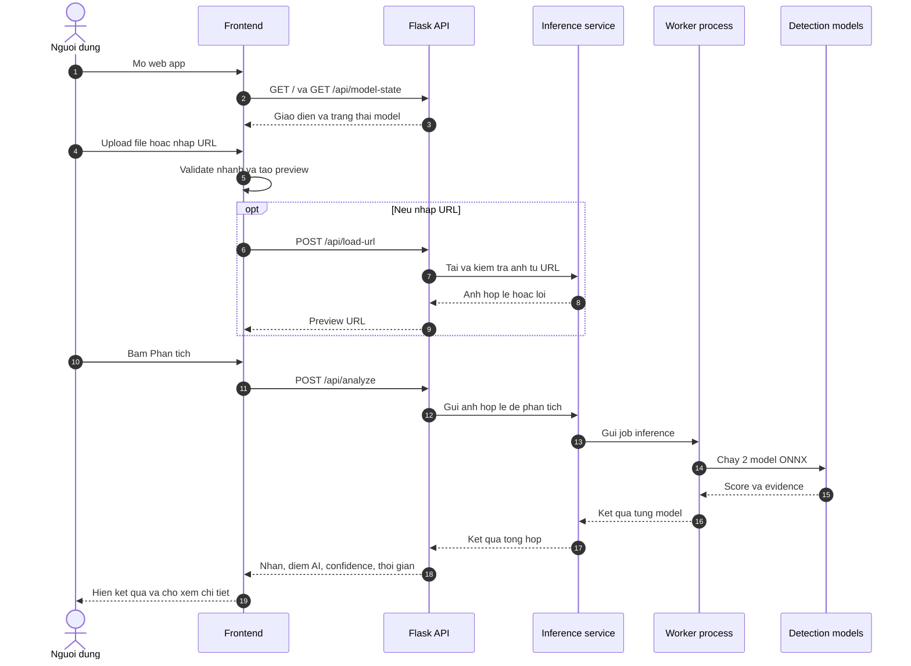
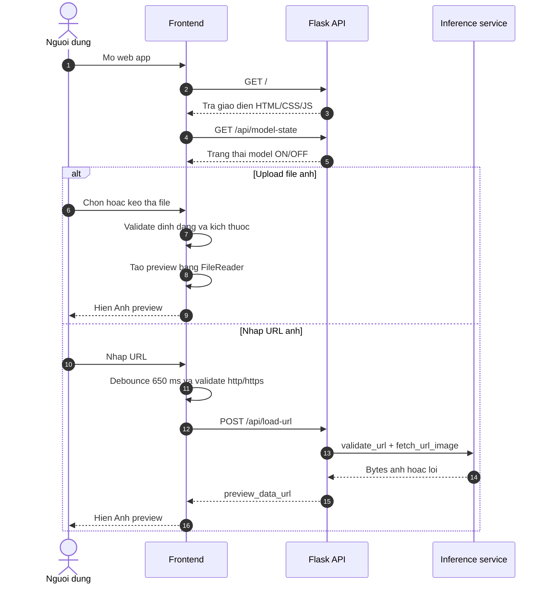
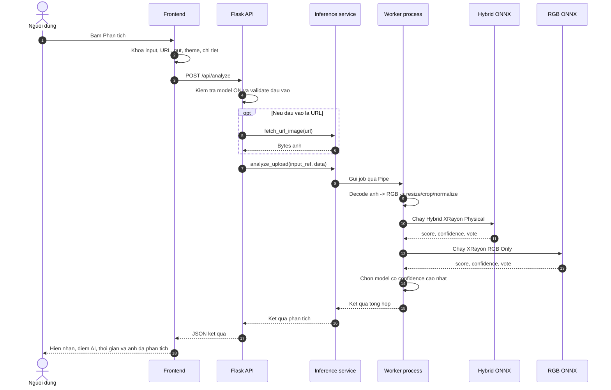
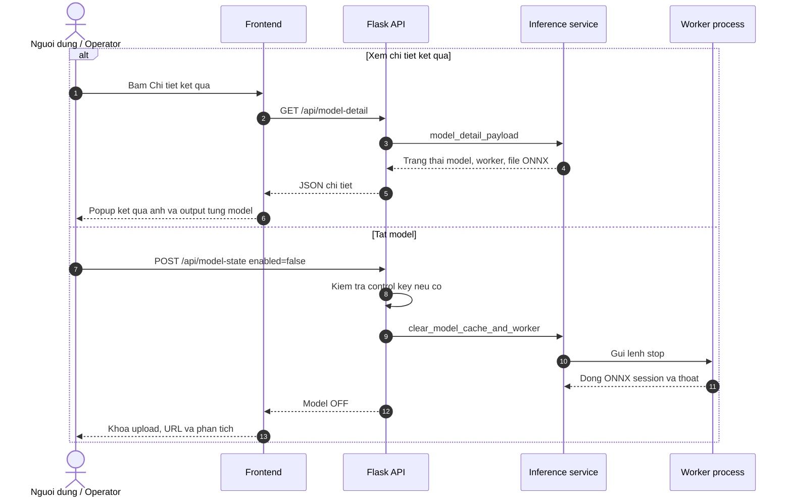

# Sequence diagrams he thong AI Generated Image Detection

## 1. Cach chia sequence

Tai lieu dung 1 sequence tong de nguoi doc nam flow end-to-end, sau do chia thanh 3 sequence chinh:

| Sequence | Muc dich |
| --- | --- |
| Sequence tong | Mo ta toan bo flow tu mo app den hien ket qua |
| Sequence 1 | Khoi dong va chuan bi anh dau vao |
| Sequence 2 | Phan tich anh va tra ket qua |
| Sequence 3 | Xem chi tiet va quan ly model |

## 2. Sequence tong - Toan bo luong he thong

## 3. Sequence 1 - Khoi dong va chuan bi anh dau vao

## 4. Sequence 2 - Phan tich anh va tra ket qua

## 5. Sequence 3 - Xem chi tiet va quan ly model

